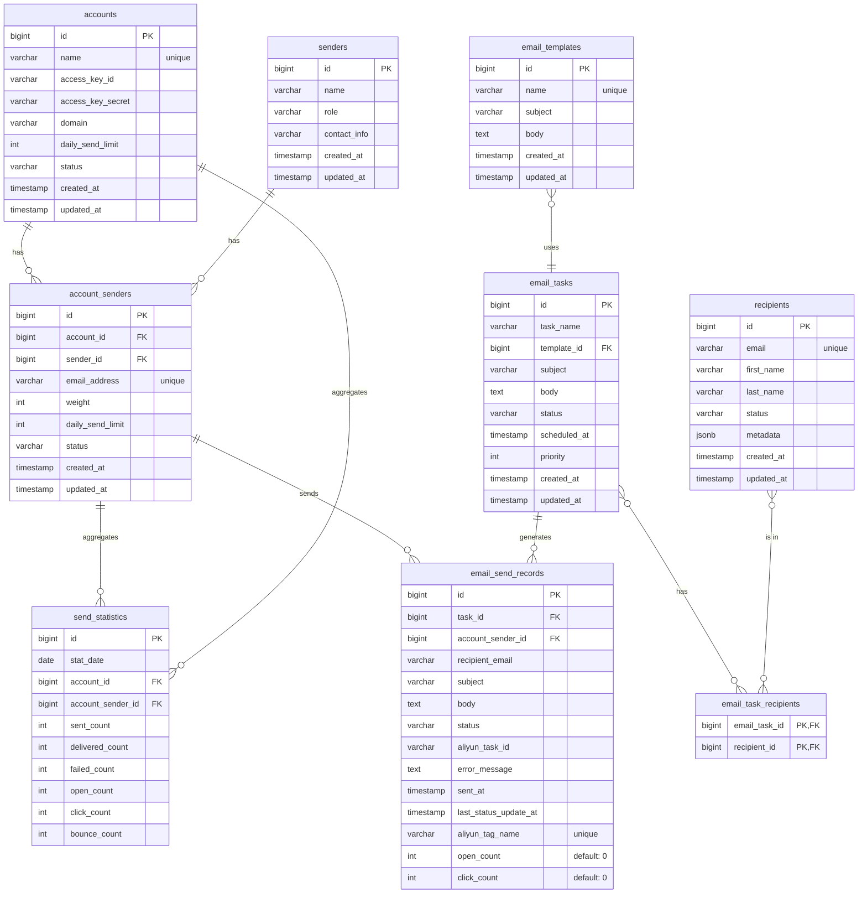

# 数据库设计

## ER 图 (实体关系图)

```mermaid
erDiagram
    accounts {
        bigint id PK
        varchar name "unique"
        varchar access_key_id
        varchar access_key_secret
        varchar domain
        int daily_send_limit
        varchar status
        timestamp created_at
        timestamp updated_at
    }

    senders {
        bigint id PK
        varchar name
        varchar role
        varchar contact_info
        timestamp created_at
        timestamp updated_at
    }

    account_senders {
        bigint id PK
        bigint account_id FK
        bigint sender_id FK
        varchar email_address "unique"
        int weight
        int daily_send_limit
        varchar status
        timestamp created_at
        timestamp updated_at
    }

    email_templates {
        bigint id PK
        varchar name "unique"
        varchar subject
        text body
        timestamp created_at
        timestamp updated_at
    }

    email_tasks {
        bigint id PK
        varchar task_name
        bigint template_id FK
        varchar subject
        text body
        varchar status
        timestamp scheduled_at
        int priority
        timestamp created_at
        timestamp updated_at
    }

    email_task_recipients {
        bigint email_task_id PK, FK
        bigint recipient_id PK, FK
    }

    email_send_records {
        bigint id PK
        bigint task_id FK
        bigint account_sender_id FK
        varchar recipient_email
        varchar subject
        text body
        varchar status
        varchar aliyun_task_id
        text error_message
        timestamp sent_at
        timestamp last_status_update_at
        varchar aliyun_tag_name "unique"
        int open_count "default: 0"
        int click_count "default: 0"
    }

    send_statistics {
        bigint id PK
        date stat_date
        bigint account_id FK
        bigint account_sender_id FK
        int sent_count
        int delivered_count
        int failed_count
        int open_count
        int click_count
        int bounce_count
    }

    recipients {
        bigint id PK
        varchar email "unique"
        varchar first_name
        varchar last_name
        varchar status
        jsonb metadata
        timestamp created_at
        timestamp updated_at
    }

    accounts ||--o{ account_senders : "has"
    senders ||--o{ account_senders : "has"
    account_senders ||--o{ email_send_records : "sends"
    account_senders ||--o{ send_statistics : "aggregates"
    accounts ||--o{ send_statistics : "aggregates"
    email_templates }o--|| email_tasks : "uses"
    email_tasks ||--o{ email_send_records : "generates"
    email_tasks }o--o{ email_task_recipients : "has"
    recipients }o--o{ email_task_recipients : "is in"
```

## 建表语句

建表语句请参考 [`../migrations/0001_initial_schema.up.sql`](../migrations/0001_initial_schema.up.sql) 文件。 